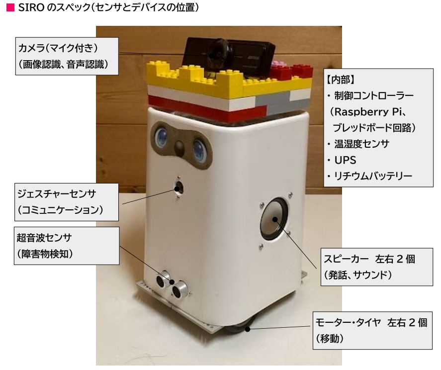
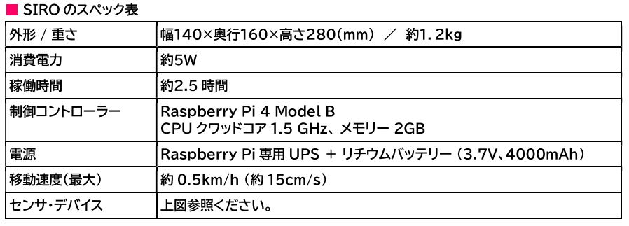

# kuro's SIRO
***SIRO*** is a communication robot created by using Raspberry Pi and equipped with basic robot functions such as autonomous movement, voice recognition, image recognition, and speech.He lives with his family at home.
 
 
***SIRO***はRaspberry Piを使って製作された自律移動、音声認識、画像認識、発話といったロボットの基本機能を備えたコミュニケーションロボットです。
彼は家で家族と一緒に暮らしています。
 
 

